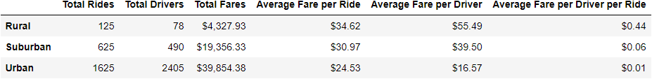

# PyBer Analysis
## Project Overview

The purpose of this analysis is to assist in the decision making process for a ride-sharing business.  Specifically in question is the allocation of resources amongst various city designations, such as Urban, Rural, and Suburban.

## Resources
- Data Source: city_data.csv
                        ride_data.csv
- Software : Python 3.8.9, Jupyter Notebook 6.1.4

## Results

[Figure1: Ride Sharing Data](analysis/Figure1.png?raw=true "Figure 1: Ride Sharing Data")

Figure 1 provides a first take overview of the data.  Total Number of rides per city tends to be higher in urban areas, followed by suburban, while rural cities tend to have the lowest number of rides per city.  Similarly, the tendency of the size of bubbles indicates that the highest driver counts are in the urban areas, followed by suburban, and last, rural.

[Average Fare Data](analysis/average_fare_data.png?raw=true "Chart 1: Average Fare Data")

Chart 1 quantifies the overview from Figure 1, indicating that the total rides increase rapidly between Rural, Suburban, and Urban markets.  Total drivers increase similarly rapidly, as do total fares.  These effects are best measured by averages, which, as shown, decrease from rural to urban (opposite to the absolute values indicated previously) in both Average Fare per Ride and Average Fare per Driver.  Total fares increase from rural through suburban up to the peak in urban fares.  An added field, Average Fare per Driver per ride indicates the marginal benefit to an additional driver and ride.  On the surface it appears the best marginal benefit to Pyber would be to increase Rural rides.

[Fig2: ride Count Data](analysis/Fig2.png?raw=true "Figure 2: Ride Count Data")

Figure 2 reiterates the increase in average number of rides across cities from rural through suburban, to the most in urban markets.  The variability appears to increase with the amount.

[Fig5: % of Total Fares by City Type](analysis/Fig5.png?raw=true "Figure5: % of Total Fares by City Type")

[Fig6: % of Total Rides by City Type](analysis/Fig2.png?raw=true "Figure 6: % of Total Rides by City Type")

Figures 5 and 6 illustrate the breakout of Total Fares and Total Rides by City Type respectively.  The split is roughly consistent between the two, with abouto 2/3 Urban, ¼ Suburban, and the remainder rural.

[Fig7: % of Total Drivers by City Type](analysis/Fig7.png?raw=true "Figure 7: % of Total Drivers by City Type")

In Figure 7 the story changes slightly, with 80% of Total drivers concentrated in urban markets, 16% in Suburban ,and the small remainder in rural areas.  This is consistent with the earlier observation that average fare per ride and average fare per driver are lowest in urban areas and highest in rural areas.

[Total Fares by City Type](analysis/Total_Fares_by_City_Type.png?raw=true "Figure 8: Total Fares by City Type")

Total Fares by city Type charts fares plotted over time.  It again shows the most fares collected in Urban areas, followed by suburban, and lagged by rural. 

## Summary
The disparities in the city type data can be addressed in three ways.  The first is a data driven one: it is important to understand that the rural rides likely have a higher fares because they are longer trips.  As such, they are likely costlier.  The data needs to be adjusted to be read relative to trip length or duration, which would squeeze out some disparity.
Second, add resources such as marketing to the most prime areas for growth.  On the surface, it would seem the marginal benefit to increasing the rural category would provide the most incremental benefit.  However, it is likely that population constraints limit the size of the opportunity in rural markets.  More data should be analyzed to include area population.  A statistic such as rides per population capita would be valuable here.
Third, increasing the quality of the rides, particularly in the suburban markets would drive the suburban line toward the urban in total fares collected.  This effort could be augmented by more data: in particular income demographics on the suburban and urban areas would allow targeted campaigns towards increasing the value of these rides.

